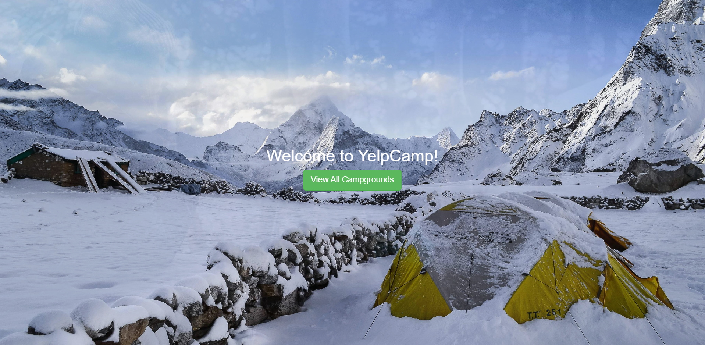
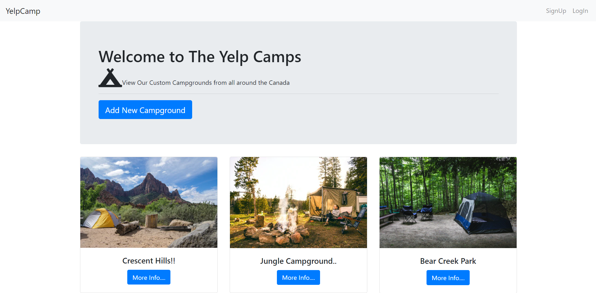
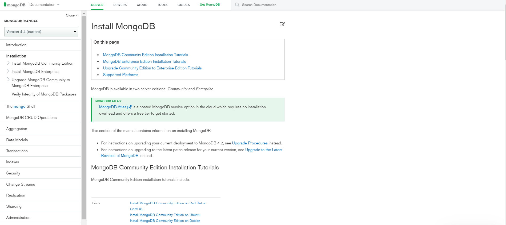
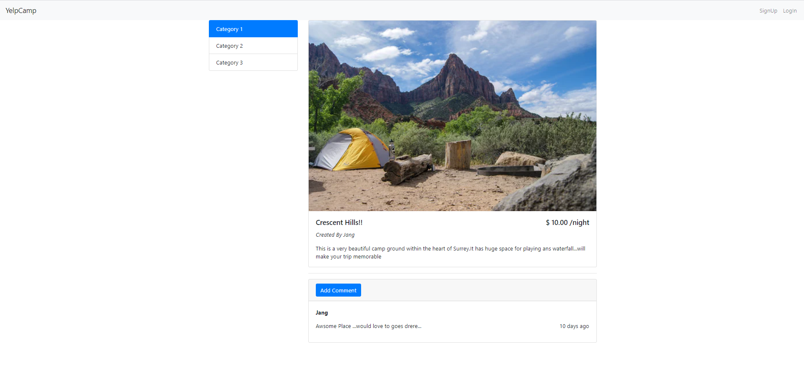
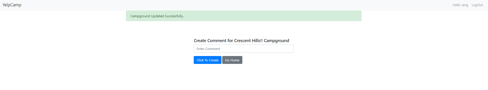
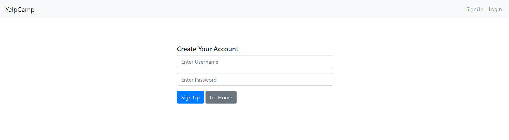
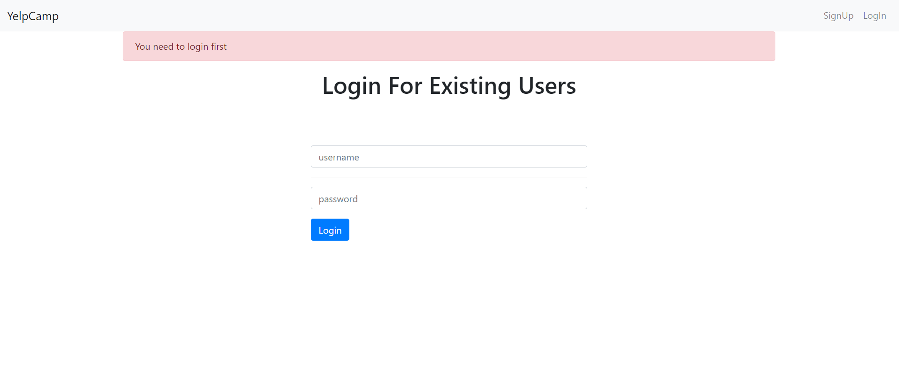
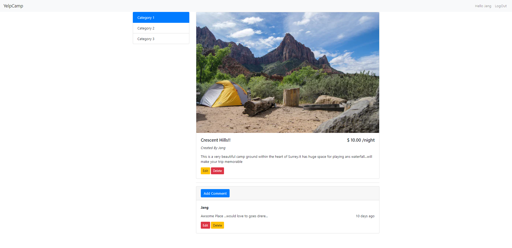
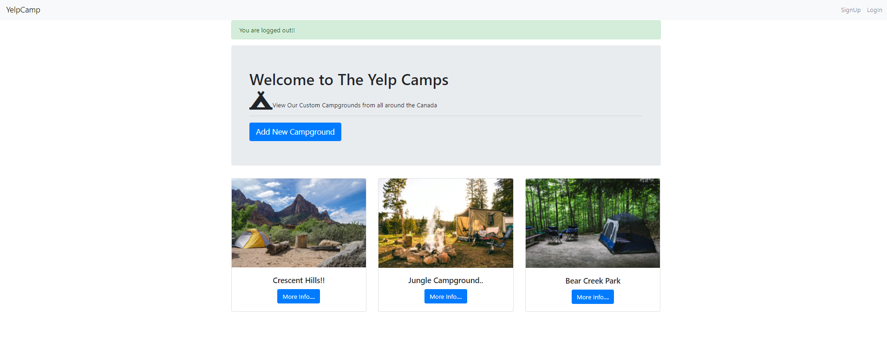

  <h1> YelpCamp</h1>

  <h2>Homepage</h2>

## Initial Setup

- [x] Add Landing Page
   
- [x] Add Campgrounds Page that lists all campgrounds

## Layout and Basic Styling

- [x] Create our header and footer partials
- [x] Add in Bootstrap

## Creating New Campgrounds

- [x] Setup new campground POST route
- [x] Add in body-parser
- [x] Setup route to show form
- [x] Add basic unstyled form

## Style the campgrounds page

- [x] Add a better header/title
- [x] Make campgrounds display in a grid

## Add Mongoose

- [x] Install and configure Mongoose
- [x] Setup campground model
- [x] Use campground model inside of our routes

## Show Page

- [x] Review the RESTful routes we've seen so far
- [x] Add description to our campground model
- [x] Show db.collection.drop()
- [x] Add a show route/template

## Refactor Mongoose Code

- [x] Create a models directory
- [x] Use module.exports
- [x] Require everything correctly
    

## Add the Comment model

- [x] Make our errors go away
- [x] Display comments on campground show page

## Comment New/Create

- [x] Discuss nested routes
- [x] Add the comment new and create routes
- [x] Add the new comment form

## Style Show Page

- [x] Add sidebar to show page
- [x] Display comments nicely

## Finish Styling Show Page

- [x] Add public directory
- [x] Add custom stylesheet

## Auth Pt. 1 - Add User Model

- [x] Install all packages needed for auth
- [x] Define User model

## Auth Pt. 2 - Register

- [x] Cconfigure Passport
- [x] Add register routes
- [x] Add register template

## Auth Pt. 3 - Login

- [x] Add login routes
- [x] Add login template

## Auth Pt. 4 - Logout/Navbar

- [x] Add logout route
- [x] Prevent user from adding a comment if not signed in
- [x] Add links to navbar

## Auth Pt. 5 - Show/Hide Links

- [x] Show/hide auth links in navbar

## Refactor The Routes

- [x] Use Express router to reoragnize all routes

## Users + Comments

- [x] Associate users and comments
- [x] Save author's name to a comment automatically

## Users + Campgrounds

- [x] Prevent an unauthenticated user from creating a campground
- [x] Save username + id to newly created campground

## Editing Campgrounds

- [x] Add method override
- [x] Add edit route for campgrounds
- [x] Add link to edit page
- [x] Add update route

## Deleting Campgrounds

- [x] Add destroy route
- [x] Add delete button

## Authorization (permission)

- [x] User can only edit his/her campgrounds
- [x] User can only delete his/her campgrounds
- [x] Hide/Show edit and delete buttons

## Editing comments

- [x] Add edit route for comments
- [x] Add edit template
- [x] Add edit button
- [x] Add update route

## Deleting comments

- [x] Add destroy route
- [x] Add delete button

## Authorization part 2: Comments

- [x] User can only edit his/her comments
- [x] User can only delete his/her comments
- [x] Hide/Show edit and delete buttons
- [x] Refactor middleware

## Adding in flash

- [x] Demo working version
- [x] Install and configure connect-flash
- [x] Add bootstrap alerts to header